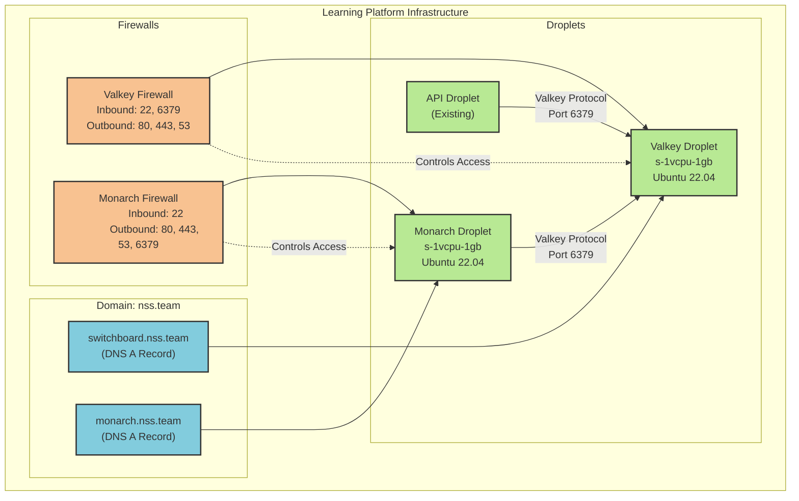

# Learning Platform Infrastructure

```mermaid
graph TB
    subgraph "Learning Platform Infrastructure"
        subgraph "Domain: nss.team"
            switchboard["switchboard.nss.team
            (DNS A Record)"]
            monarch["monarch.nss.team
            (DNS A Record)"]
        end

        subgraph "Droplets"
            vd["Valkey Droplet
            s-1vcpu-1gb
            Ubuntu 22.04"]
            md["Monarch Droplet
            s-1vcpu-1gb
            Ubuntu 22.04"]
            api["API Droplet
            (Existing)"]
        end

        subgraph "Firewalls"
            vf["Valkey Firewall
            Inbound: 22, 6379
            Outbound: 80, 443, 53"]
            mf["Monarch Firewall
            Inbound: 22
            Outbound: 80, 443, 53, 6379"]
        end
    end

    %% Connections
    switchboard --> vd
    monarch --> md
    vf --> vd
    mf --> md

    %% Service Communications
    md -->|"Valkey Protocol
    Port 6379"| vd
    api -->|"Valkey Protocol
    Port 6379"| vd

    %% Firewall Rules
    vf -.->|"Controls Access"| vd
    mf -.->|"Controls Access"| md

    classDef droplet fill:#b8e994,stroke:#333,stroke-width:2px
    classDef firewall fill:#f8c291,stroke:#333,stroke-width:2px
    classDef dns fill:#82ccdd,stroke:#333,stroke-width:2px

    class vd,md,api droplet
    class vf,mf firewall
    class switchboard,monarch dns
```