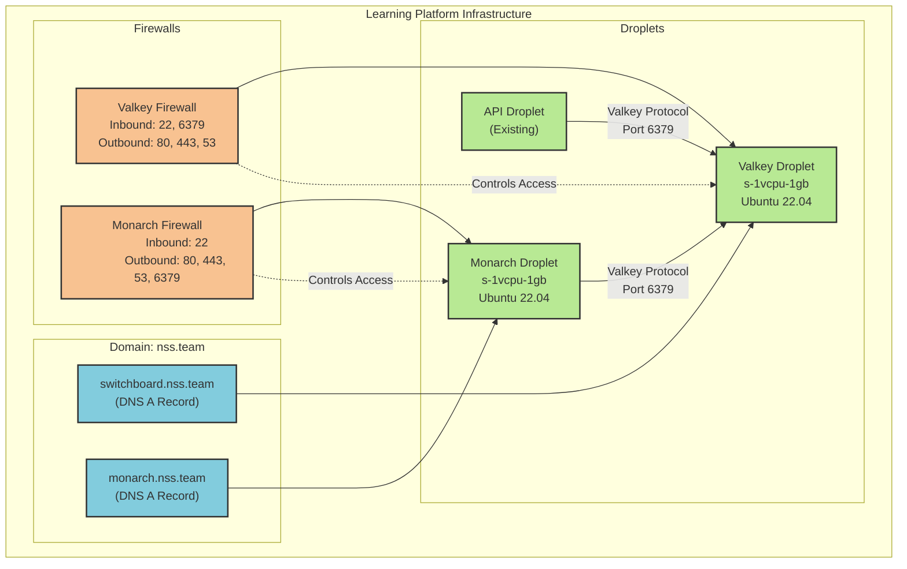

# Learning Platform Infrastructure



If you are trying to build and deploy your own system, you will also need to modify the following terraform configurations.

```tf
data "digitalocean_domain" "default" {
  name = "nss.team"  # Change this to your TLD
}

resource "digitalocean_record" "valkey" {
  domain = data.digitalocean_domain.default.id
  type   = "A"
  name   = "switchboard"   # Change this to your preferred subdomain
  value  = digitalocean_droplet.valkey.ipv4_address
  ttl    = 300
}

resource "digitalocean_record" "monarch" {
  domain = data.digitalocean_domain.default.id
  type   = "A"
  name   = "monarch"       # Change this to your preferred subdomain
  value  = digitalocean_droplet.monarch.ipv4_address
  ttl    = 300
}
```
