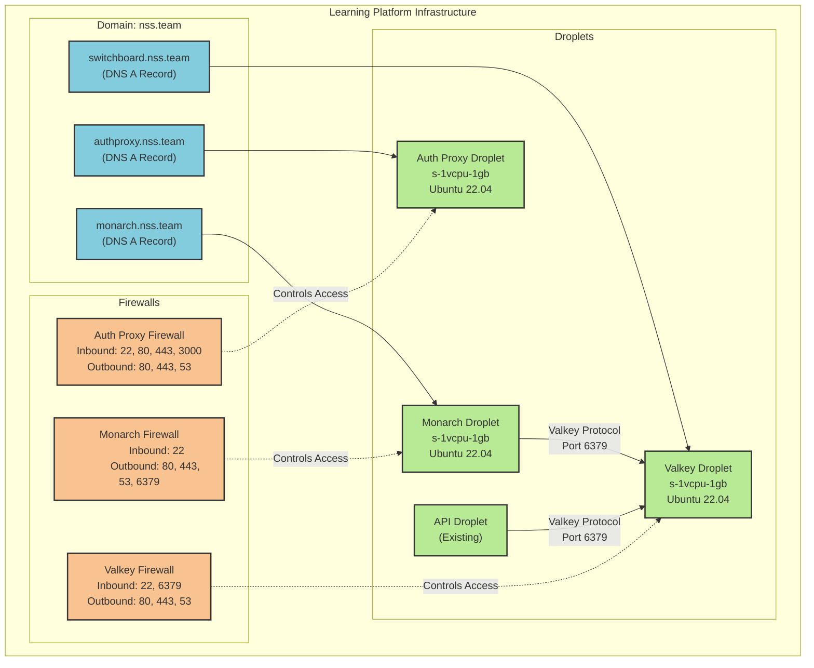

# Learning Platform Infrastructure



If you are trying to build and deploy your own system, you will also need to modify the following terraform configurations.

```tf
data "digitalocean_domain" "default" {
  name = "nss.team"  # Change this to your TLD
}

resource "digitalocean_record" "valkey" {
  domain = data.digitalocean_domain.default.id
  type   = "A"
  name   = "switchboard"   # Change this to your preferred subdomain
  value  = digitalocean_droplet.valkey.ipv4_address
  ttl    = 300
}

resource "digitalocean_record" "monarch" {
  domain = data.digitalocean_domain.default.id
  type   = "A"
  name   = "monarch"       # Change this to your preferred subdomain
  value  = digitalocean_droplet.monarch.ipv4_address
  ttl    = 300
}

resource "digitalocean_record" "authproxy" {
  domain = data.digitalocean_domain.default.id
  type   = "A"
  name   = "authproxy"     # Change this to your preferred subdomain
  value  = digitalocean_droplet.authproxy.ipv4_address
  ttl    = 300
}
```

## SSL Certificate Configuration

The Auth Proxy droplet is configured to automatically obtain and renew SSL certificates using Certbot. You'll need to provide an email address for certificate notifications:

```tf
variable "ssl_cert_email" {
  description = "Email address to use for certbot-created certificates"
  type        = string
}
```

This email will be used for important notifications about certificate expiration and renewal. The certificates are automatically obtained during the initial setup and a cron job is configured for automatic renewal.

Save the `terraform.tfvars.example` file as a new `terraform.tfvars` file and update the variables with the values that you want.